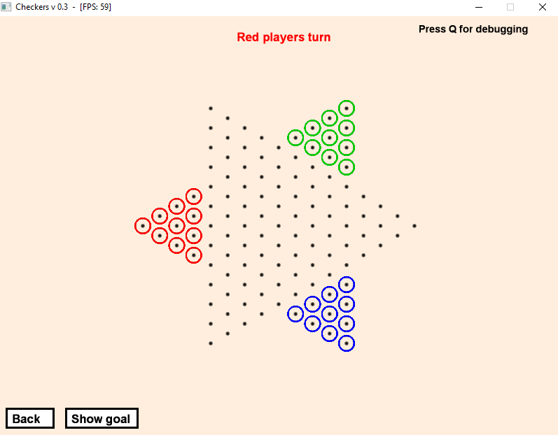

# Checkers - 2020

## Description
Small game written in ruby. The project began in March 2020 and was finished around April. Finally decided to upload this on Github.

## Screenshots

## Requirements
- Ruby 2.2.6 (only tested with 2.2.6, but should work with newer versions)

Ruby Gems:

- Gosu 0.10.8 (only tested with 0.10.8, but should work with newer versions)

## User Manual
to be made

## Credits
to be made
